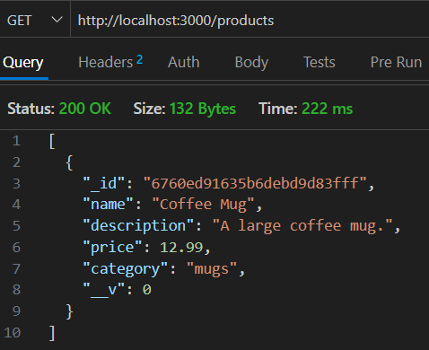
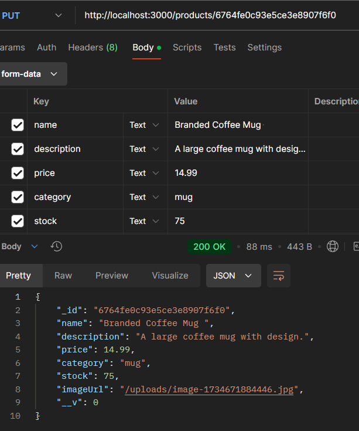

# Coffee Shop Backend

- [Part 2: JWT User Authentication & Protected Routes](#coffee-shop-backend---part-2)
- [Part 3: Expanding API and Error Handling](#coffee-shop-backend---part-3)
- [Part 4: Pagination and Handling File Uploads](#coffee-shop-backend---part-4)

## Overview / Objective

The Coffee Shop Backend is a Node.js-based Express application that serves as the backend for an e-commerce coffee shop. It provides APIs for managing products with full CRUD (Create, Read, Update, Delete) functionality. The backend uses MongoDB with Mongoose for database operations, allowing efficient storage and retrieval of product data.

### Key Features

- **CRUD Operations**: Implemented APIs for managing products, including creating, reading, updating, and deleting.
- **MongoDB Integration**: Utilizes Mongoose for schema definition and database interactions.
- **Scalability**: Provides a modular design with separation of concerns for easier maintenance and extensibility.

## Setup

### Prerequisites

Ensure you have the following installed:

- Node.js (v16 or higher)
- MongoDB (local or cloud-based like MongoDB Atlas)

### Steps to Set Up the Project

1. Clone the repository:

   ```bash
   git clone <repository_url>
   cd coffee-shop-backend
   ```

2. Install dependencies:

   ```bash
   npm install
   ```

3. Create a `.env` file in the root directory and set your MongoDB connection string:

   ```env
   MONGO_URL=your-mongodb-connection-string
   ```

4. Start the server:

   - For development (using `nodemon`):
     ```bash
     npm run dev
     ```
   - For production:
     ```bash
     npm start
     ```

5. Test the server:
   Open a browser or API client (e.g., Thunder Client, Postman) and navigate to `http://localhost:3000`.

## Defining the Product Model

The product schema is defined in `models/product.js`. It includes the following fields:

- **name**: String, required
- **description**: String, required
- **price**: Number, required
- **category**: String, required
- **stock**: Number
- **imageUrl**: String

### Example Code:

```javascript
const mongoose = require("mongoose");

const productSchema = mongoose.Schema({
  name: { type: String, required: true },
  description: { type: String, required: true },
  price: { type: Number, required: true },
  category: { type: String, required: true },
  stock: { type: Number },
  imageUrl: { type: String },
});

const Product = mongoose.model("Product", productSchema);
module.exports = Product;
```

## Implementing Basic CRUD Operations

### Process

1. **Foundation Route**: A base route was created to verify the setup using Thunder Client:

   ```javascript
   router.get("/", (req, res) => {
     res.json({ message: "Get all products" });
   });
   ```

2. **CRUD Routes**:
   - **POST `/products`**: Create a new product.
   - **GET `/products`**: Retrieve all products.
   - **GET `/products/:id`**: Retrieve a product by ID.
   - **PUT `/products/:id`**: Update a product by ID.
   - **DELETE `/products/:id`**: Delete a product by ID.

### Example Code:

- **Get All Products**:

  ```javascript
  productRoutes.get("/", async (req, res) => {
    try {
      const products = await Product.find();
      res.json(products);
    } catch (error) {
      res.status(500).json({ error: error.message });
    }
  });
  ```

- **Delete a Product by ID**:
  ```javascript
  productRoutes.delete("/:id", async (req, res) => {
    try {
      const product = await Product.findByIdAndDelete(req.params.id);
      if (!product) {
        return res.status(404).json({ error: "Product not found" });
      }
      res
        .status(200)
        .json({ message: "Product deleted successfully", product });
    } catch (error) {
      res.status(500).json({ error: error.message });
    }
  });
  ```

### Testing the Routes

1. **Create a Product**:

   - Method: POST
   - URL: `http://localhost:3000/products`
   - Body (JSON):
     ```json
     {
       "name": "Coffee Mug",
       "description": "A large coffee mug.",
       "price": 12.99,
       "category": "mugs",
       "stock": 100,
       "imageUrl": "http://example.com/mug.jpg"
     }
     ```
   - **Screenshots:**  
     

     

2. **Retrieve All Products**:

   - Method: GET
   - URL: `http://localhost:3000/products`
   - **Screenshots:**  
     

3. **Retrieve a Single Product by ID**:

   - Method: GET
   - URL: `http://localhost:3000/products/<product_id>`
   - **Screenshots:**  
     

4. **Update a Product**:

   - Method: PUT
   - URL: `http://localhost:3000/products/<product_id>`
   - Body (JSON):
     ```json
     {
       "name": "Large Coffee Mug",
       "description": "A large coffee mug, perfect for your morning coffee.",
       "price": 14.99,
       "stock": 50
     }
     ```
   - **Screenshots:**  
     

     

5. **Delete a Product**:
   - Method: DELETE
   - URL: `http://localhost:3000/products/<product_id>`
   - **Screenshots:**  
     

### Workflow

Each foundational route was first tested individually to ensure proper setup and functioning. After verification, additional CRUD routes were implemented and tested one by one. This step-by-step approach ensured a consistent workflow and helped to limit errors during development.

## Testing the API

Testing was conducted using Thunder Client for all routes:

- Verified each route individually during implementation.
- Validated request and response payloads for correctness.
- Screenshots were taken for POST, GET, PUT, and DELETE operations for submission.

### Example Commands for Debugging

To debug errors during testing, use:

```bash
npm run dev
```

Inspect the console for error logs during API interactions.

## What I’ve Learned

- **Consistent Workflow**: Implementing and testing routes one by one allowed for a streamlined development process and minimized potential issues.
- **Error Handling**: Debugging using console logs and inspecting response payloads helped in identifying and resolving errors efficiently.
- **Mongoose Integration**: Leveraging Mongoose for schema validation and database operations simplified data handling.

## Completion

This assignment fulfilled all the requirements:

- Setting up the Express project.
- Connecting to MongoDB using Mongoose.
- Defining the Product model.
- Implementing and testing CRUD operations for the products API.

---

# Coffee Shop Backend - Part 2

## Overview

This section builds upon the Coffee Shop Backend by adding user authentication functionality using JSON Web Tokens (JWT). The main features include:

- Setting up user authentication with JWT.
- Implementing registration and login endpoints.
- Protecting routes using authentication middleware.
- Testing the API.

## Setup

### Additional Dependencies

To enable user authentication, the following dependencies were installed:

```bash
npm install bcryptjs jsonwebtoken
```

### Environment Variables

Updated `.env` file to include the following variables:

```env
MONGO_URL=<your_mongodb_connection_string>
JWT_SECRET=<your_jwt_secret_key>
```

### User Model

The `User` model was created in `models/user.js` to define the schema for user data and manage password hashing.

```javascript
const mongoose = require("mongoose");
const bcrypt = require("bcryptjs");

const userSchema = new mongoose.Schema({
  name: { type: String, required: true },
  email: { type: String, required: true, unique: true },
  password: { type: String, required: true },
  role: { type: String, default: "user", enum: ["user", "admin"] },
});

// Hash the password before saving the user
userSchema.pre("save", async function (next) {
  if (!this.isModified("password")) {
    return next();
  }

  try {
    const salt = await bcrypt.genSalt(10);
    this.password = await bcrypt.hash(this.password, salt);
    next();
  } catch (error) {
    next(error);
  }
});

// Method to compare passwords
userSchema.methods.comparePassword = async function (candidatePassword) {
  return await bcrypt.compare(candidatePassword, this.password);
};

const User = mongoose.model("User", userSchema);

module.exports = User;
```

## Implementing Registration and Login Endpoints

### Routes

Authentication routes were implemented in `routes/auth.js` to handle user registration and login.

#### Register a User

```javascript
router.post("/register", async (req, res) => {
  try {
    const { name, email, password, role } = req.body;
    const user = new User({ name, email, password, role });
    await user.save();
    res.status(201).json({ message: "User registered successfully" });
  } catch (error) {
    res.status(400).json({ error: error.message });
  }
});
```

#### Login a User

```javascript
router.post("/login", async (req, res) => {
  try {
    const { email, password } = req.body;
    const user = await User.findOne({ email });
    if (!user) {
      return res.status(400).json({ error: "Invalid email or password" });
    }
    const isMatch = await user.comparePassword(password);
    if (!isMatch) {
      return res.status(400).json({ error: "Invalid email or password" });
    }
    const token = jwt.sign(
      { userId: user._id, role: user.role },
      process.env.JWT_SECRET,
      { expiresIn: "1h" }
    );
    res.json({ token });
  } catch (error) {
    res.status(500).json({ error: error.message });
  }
});
```

## Creating Authentication Middleware

The middleware `auth` was created in `middleware/auth.js` to protect routes by verifying JWT tokens.

```javascript
const jwt = require("jsonwebtoken");
require("dotenv").config();

const auth = (req, res, next) => {
  let token;

  try {
    token = req.header("Authorization").replace("Bearer ", "");
  } catch (error) {
    return res
      .status(401)
      .json({ message: "Authorization header is missing." });
  }

  if (!token) {
    return res.status(401).json({ error: "Access denied. No token provided." });
  }

  try {
    const decoded = jwt.verify(token, process.env.JWT_SECRET);
    req.user = decoded;
    next();
  } catch (error) {
    res.status(400).json({ error: "Invalid token." });
  }
};

module.exports = auth;
```

## Integrating Routes with the Server

The `auth` routes and middleware were integrated into the server in `index.js`:

```javascript
const express = require("express");
const mongoose = require("mongoose");
require("dotenv").config();
const productRoutes = require("./routes/products");
const authRoutes = require("./routes/auth");
const auth = require("./middleware/auth");
const app = express();
const port = 3000;

// Middleware to parse JSON bodies
app.use(express.json());

// Connect to MongoDB
mongoose
  .connect(process.env.MONGO_URL)
  .then(() => {
    console.log("Connected to MongoDB");
  })
  .catch((error) => {
    console.error("Error connecting to MongoDB:", error);
  });

// Authentication routes
app.use("/auth", authRoutes);

// Protect product routes
app.use("/products", auth, productRoutes);

app.listen(port, () => {
  console.log(`Server is running at http://localhost:${port}`);
});
```

## Testing the API

The API was tested using Thunder Client. Below are the steps and screenshots:

### 1. Register a User

**Method:** POST  
**URL:** `http://localhost:3000/auth/register`  
**Body:**

```json
{
  "name": "John Doe",
  "email": "john@example.com",
  "password": "password123",
  "role": "user"
}
```

**Screenshot:**  
 

### 2. Login a User

**Method:** POST  
**URL:** `http://localhost:3000/auth/login`  
**Body:**

```json
{
  "email": "john@example.com",
  "password": "password123"
}
```

**Screenshot:**  


### 3. Access Protected Product Routes

**Method:** GET  
**URL:** `http://localhost:3000/products`  
**Headers:**

```plaintext
Authorization: Bearer <your_jwt_token>
```

**Screenshot:**  


## Coffee Shop Backend - Part 3

### Overview

In this continuation of the Coffee Shop Backend project, we expanded the API's functionality by implementing additional endpoints, refining existing product routes, handling errors effectively, and testing the API thoroughly. Below are the steps taken in this iteration:

---

### Step 1: Adding More Endpoints to the API

#### User Routes (`routes/users.js`)

- **CRUD Operations for Users**: Added routes to create, read, update, and delete users, including admin-only restrictions for sensitive operations.
- **Authentication**: Integrated the `auth` middleware to ensure proper role-based access.

```javascript
// routes/users.js
router.get("/", auth, async (req, res) => {
  /* Get all users */
});
router.get("/:id", auth, async (req, res) => {
  /* Get single user by ID */
});
router.put("/:id", auth, async (req, res) => {
  /* Update user by ID */
});
router.delete("/:id", auth, async (req, res) => {
  /* Delete user by ID (admin only) */
});
```

---

### Step 2: Refining Product Endpoints

#### Product Routes (`routes/products.js`)

- **Category Filtering**: Enhanced the `GET /products` endpoint to include optional category-based filtering using query parameters.
- **CRUD Refinements**: Improved error handling and validation for create, update, and delete operations.

```javascript
// routes/products.js
router.get("/", async (req, res) => {
  /* Get all products or filter by category */
});
router.post("/", async (req, res) => {
  /* Create a new product */
});
router.put("/:id", async (req, res) => {
  /* Update a product */
});
router.delete("/:id", async (req, res) => {
  /* Delete a product */
});
```

---

### Step 3: Handling Errors and Edge Cases

#### Error Handling Middleware (`middleware/errorHandler.js`)

- Centralized error handling to manage server-side issues and provide consistent error responses.
- Logged errors to the console for easier debugging.

```javascript
// middleware/errorHandler.js
const errorHandler = (err, req, res, next) => {
  console.error(err.stack);
  res.status(500).json({ error: "Something went wrong!" });
};

module.exports = errorHandler;
```

---

### Step 4: Integrating with the Server

#### `index.js`

- **Integration**: Connected the new `user` routes and error handling middleware to the main server file.
- **Authentication Middleware**: Ensured protected routes are accessible only to authenticated users.

```javascript
// index.js
const userRoutes = require("./routes/users");
const errorHandler = require("./middleware/errorHandler");

app.use("/users", auth, userRoutes);
app.use(errorHandler);
```

---

### Step 5: Testing the API

- **Tool Used**: Thunder Client

#### Test Results

1. **Get All Users (Admin Only)**:

   - **Method**: GET
   - **URL**: `/users`
   - **Headers**:
     - Authorization: Bearer `<token>`
   - **Screenshot**:  
     

2. **Get a Single User by ID**:

   - **Method**: GET
   - **URL**: `/users/1`
   - **Headers**:
     - Authorization: Bearer `<token>`
   - **Screenshot**:  
     

3. **Update a User**:

   - **Method**: PUT
   - **URL**: `/users/1`
   - **Headers**:
     - Authorization: Bearer `<token>`
   - **Body**:
     ```json
     {
       "name": "Jane Doe",
       "email": "jane@example.com"
     }
     ```
   - **Screenshot**:  
     

4. **Delete a User (Admin-Only)**:

   - **Method**: DELETE
   - **URL**: `/users/1`
   - **Headers**:
     - Authorization: Bearer `<admin-token>`
   - **Screenshot**:  
     

5. **Get Products by Category**:

   - **Method**: GET
   - **URL**: `/products?category=mugs`
   - **Screenshot**:  
     

6. **Get a Single Product by ID**:

   - **Method**: GET
   - **URL**: `/products/1`
   - **Screenshot**:  
     

7. **Update a Product**:

   - **Method**: PUT
   - **URL**: `/products/1`
   - **Headers**:
     - Authorization: Bearer `<token>`
   - **Body**:
     ```json
     {
       "name": "Large Coffee Mug",
       "description": "A large coffee mug, perfect for your morning coffee.",
       "price": 14.99,
       "category": "mugs",
       "stock": 50,
       "imageUrl": "http://example.com/mug.jpg"
     }
     ```
   - **Screenshot**:  
     

8. **Delete a Product**:
   - **Method**: DELETE
   - **URL**: `/products/1`
   - **Headers**:
     - Authorization: Bearer `<token>`
   - **Screenshot**:  
     

---

### Conclusion

This iteration successfully expanded the API's capabilities, improved error handling, and ensured a robust testing process.

---

# Coffee Shop Backend - Part 4

This section continues the development of the Coffee Shop Backend, focusing on pagination for product listings, handling file uploads for product images, and integrating these features into the API.

## Features Implemented

### 1. Pagination for Product Listings

- Updated the `routes/products.js` file to support pagination.
- Features include:
  - Query parameters for `page` and `limit` to control the number of products returned per page.
  - Filtering by `category`.
  - Sorting by fields such as `price` or `name` in ascending or descending order.
- Example Request:
  ```http
  GET /products?page=1&limit=10&category=coffee&sortBy=price&sortOrder=desc
  ```
- Example Response:
  ```json
  {
    "total": 50,
    "products": [
      { "name": "Coffee Mug", "price": 12.99 },
      { "name": "Espresso Cup", "price": 9.99 }
    ]
  }
  ```

### 2. File Uploads for Product Images

- Integrated the `multer` middleware for handling file uploads.
- File upload capabilities were added to `routes/products.js`.
- Uploaded images are stored in the `uploads/` directory and are served as static files.

#### Middleware: `middleware/uploads.js`

- Configures file upload parameters:
  - Storage engine to save files with a timestamped filename.
  - File size limit of 1MB.
  - Validation to accept only image files (`jpeg`, `jpg`, `png`, `gif`, `webp`).

#### Server Integration

- Updated the main server file (`index.js`) to serve the `uploads` folder as static files:

  ```javascript
  const path = require("path");

  app.use("/uploads", express.static(path.join(__dirname, "uploads")));
  ```

### 3. Updated Product Routes for File Uploads

- Modified `POST /products` to include file uploads and associate the uploaded image URL with the product.
- Modified `PUT /products/:id` to allow updating product details along with an optional new image.

#### Example Request (Create Product):

```http
POST /products
Headers: Authorization: Bearer <token>
Body (Form Data):
  name: Coffee Mug
  description: A durable coffee mug.
  price: 14.99
  category: mugs
  stock: 200
  image: [Upload Image File]
```

### 4. API Testing

#### Tools Used

- Postman (Desktop version) for creating and testing API requests.

#### Tests Performed:

- **Create Product with Image Upload:** Successfully tested image upload functionality by submitting a POST request with form-data.
- **Get All Products with Pagination & Filtering:** Verified that the API returns the correct paginated results and applies category filters.
- **Update Product by ID:** Confirmed that updating a product's details, including its image, works as expected.

### Screenshots

1. **POST /products with image upload**:  
   
2. **GET /products with pagination and filtering**:  
   
3. **PUT /products/:id to update product**:  
   

---

## What I Learned

During the implementation of image uploads, I encountered issues where the `req.file` object was coming back as `undefined`. This resulted in the image URL being empty in the database. Debugging involved several steps:

1. **Console Logging**:

   - Verified that the middleware setup in `uploads.js` was correctly configured.
   - Ensured that the request was properly formatted in Postman.

2. **Testing Alternatives**:

   - Used `curl` commands to test the API, which worked flawlessly, suggesting the issue was specific to Postman.

3. **Identifying the Problem**:

   - Discovered that the Postman extension for VS Code differed from the desktop version.
   - Additionally, syncing files with OneDrive caused file path issues.

4. **Solution**:
   - Downloaded the Postman desktop version.
   - Unsynced the project folder from OneDrive to resolve file upload path conflicts.

### Insights Gained

- **Debugging Skills**: Learned the importance of isolating issues by testing with different tools (e.g., Postman vs. `curl`).
- **Environment Matters**: Realized how cloud syncing services like OneDrive can interfere with file handling.
- **Tool-Specific Behaviors**: Understood that the Postman desktop app offers a more reliable environment for file uploads compared to the VS Code extension.

---

## Installed

- To ensure file upload functionality, install the required `multer` package:
  ```bash
  npm install multer
  ```

# Coffee Shop Backend - Final Update (Part 5)

## Finalizing the API

### Role-Based Access Control (RBAC)

- **Middleware Implementation**:
  Created `middleware/role.js` to define role-based access control. The middleware checks if the user's role matches the required role for accessing specific routes.

  ```javascript
  const role = (requiredRole) => {
    return (req, res, next) => {
      if (req.user.role !== requiredRole) {
        return res.status(403).json({ error: "Access denied." });
      }
      next();
    };
  };

  module.exports = role;
  ```

- **Protecting Routes**:
  Updated `routes/products.js` to include role-based access control for administrative actions (e.g., adding, updating, and deleting products).

### Input Validation

- **Middleware Implementation**:
  Created `middleware/validate.js` using Joi to validate product input fields for API requests.

  ```javascript
  const Joi = require("joi");

  const validateProduct = (req, res, next) => {
    const schema = Joi.object({
      name: Joi.string().required(),
      description: Joi.string().required(),
      price: Joi.number().required(),
      category: Joi.string().required(),
      stock: Joi.number().required(),
      imageUrl: Joi.string().uri(),
    });

    const { error } = schema.validate(req.body);
    if (error) {
      return res.status(400).json({ error: error.details[0].message });
    }
    next();
  };

  module.exports = { validateProduct };
  ```

- **Route Integration**:
  Integrated validation middleware into `routes/products.js` for routes like product creation and updates.

## Preparing for Deployment

### Updates to `index.js`

- Added `.env` file for environment variables:
  ```plaintext
  PORT=3000
  MONGODB_URL=your-mongodb-connection-string
  JWT_SECRET=your_jwt_secret
  ```
- Updated `index.js` to use environment variables and ensure compatibility with deployment requirements.
  ```javascript
  require("dotenv").config();
  const port = process.env.PORT || 3000;
  ```

## Deploying to Render.com

### Deployment Steps

1. **Account Setup**:
   Created an account on [Render.com](https://render.com) and connected the GitHub repository containing the backend project.
2. **Web Service Configuration**:
   - Service Name: `coffee-shop-backend`
   - Environment: Node
   - Build Command: `npm install`
   - Start Command: `node index.js`
   - Environment Variables: Added the variables from `.env` file.
3. **Deployment**:
   Successfully deployed the API to Render.com.

## Testing the Deployed API

- **Endpoint Testing**:
  Used Postman and Thunder Client to test all endpoints of the deployed API.

  - Example:
    - URL: `https://coffee-shop-backend-fubs.onrender.com/products`
    - Method: `GET`
  - Verified protected routes with authentication and role-based access.

- **Screenshots**:
  Screenshots of successful API tests in Postman.  
  

  

  

  

## Project Wrap-Up

### Key Features Implemented

1. **Authentication and Authorization**:
   - User authentication with JWT.
   - Role-based access control for admin and user permissions.
2. **Product Management**:
   - CRUD operations for products with image uploads.
   - Pagination and filtering capabilities.
3. **Middleware Development**:
   - Authentication, role-based access control, and input validation middleware.
   - Custom error handling.
4. **Deployment**:
   - Environment configuration for MongoDB, JWT secrets, and deployment to Render.com.
5. **API Documentation**:
   - Documented API endpoints for easy testing and usage.

#### Challenges and Solutions

- Overcame testing discrepancies between the Postman VS Code extension and desktop application by switching to the latter, which offered superior synchronization with API settings and environment management.

#### Final Notes

This project successfully demonstrates the development of a robust, scalable, and secure backend API for a coffee shop e-commerce platform. The API is fully tested and deployed, ready for integration with a frontend application.
